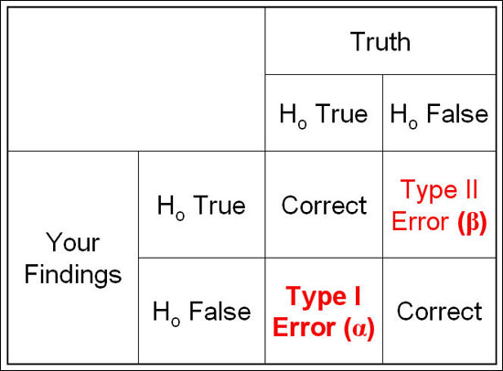
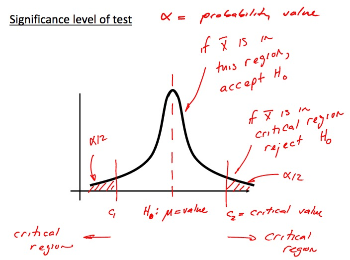
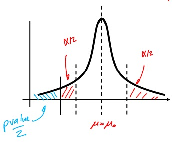
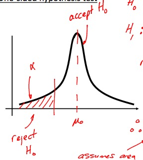
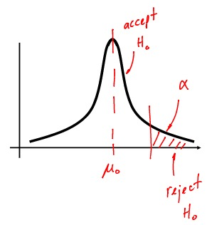
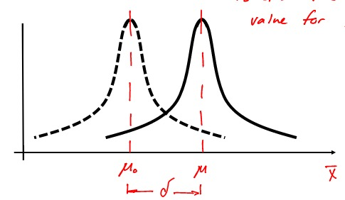
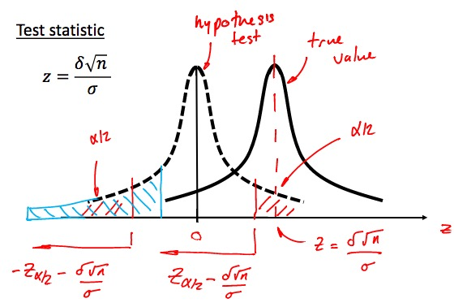
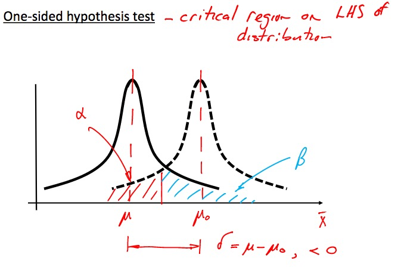
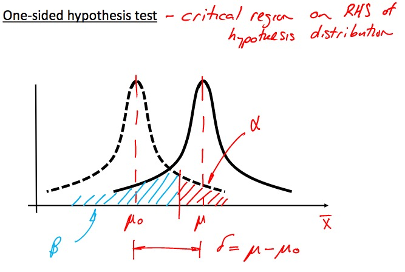

# Lecture 22 - Hypothesis Testing

> **Point Estimate**:  
> if we can only choose one value to estimate the population mean, this is our best guess  
>
> **Hypothesis Test**:  
> Test hypothesis of a population parameter (mean, stdev., etc) using sample data
  
> **Null Hypothesis**: The one skeptical and **specific** claim to be tested  
>
> **Alternative Hypothesis**: Alternative claim, usually means $\to$ all other possible values

> {#id .class width=300px}

> 

# Lecture 23 - One and Two-sided Hypothesis Tests

> Steps:
>
> 1. State $H_0, H_A$
> 2. Select test statistic
> 3. Determine reject and non-reject reigons
> 4. Calculate test statistic. Check which region it is in

> Approach **(1)**:  
> Fixed $\alpha$ (significance leve/probability) value  
> 
> Approach **(2)**:  
> Variable $p$ value. $p$ is the probability *$H_0$ is false, and parameter purely happened to be that certain value by **chance** *

## Two-Sided Hypothesis Test

> **Remember to make the opposite equality! $H_0$ should always be the claim!**

>
> $H_0: \mu = \mu_0$  
> $H_A: \mu \neq \mu_0$
> 
> Reject $H_0$ if $p < \alpha$
>
> 

## One-Sided Hypothesis Test

> 
> $H_0: \mu = \mu_0$  
> $H_A: \mu < \mu_0$
> 
> Reject $H_0$ if $p < \alpha$
>
> 

> 
> $H_0: \mu = \mu_0$  
> $H_A: \mu > \mu_0$
> 
> Reject $H_0$ if $p < \alpha$
>
> 

# Lecture 24

## Probability of Type II Error 

>
> 

>
> 
>
> $$\mu = \mu_0 + \delta$$
>  
> $$
\begin{align}
Z &= \frac{\overline{x} - \mu_0}{\sigma / \sqrt{n}}  \\
&= \frac{\mu_0 + \delta - \mu_0}{\sigma/\sqrt{n}}  \\
&= \frac{\delta \sqrt{n}}{\sigma}
\end{align}
$$

> To find $\beta$, shift from truth to $H_0$ reference frame
> $$\beta = P(-Z_{\alpha/2} - \frac{\delta \sqrt{n}}{\sigma} < Z < Z_{\alpha/2} - \frac{\delta \sqrt{n}}{\sigma} )$$
> 

> 
> Probability of Type I error is just $\alpha$

# Lecture 25

## How parameters effect probability of Type I and II error

> 
> $P(\text{Type I})$ is reduced with:
>
> 1. $\alpha \downarrow$
> 2. $n \uparrow $

> 1. $\alpha \downarrow = \beta \uparrow$ 
> 2. $n \uparrow  = \beta \downarrow , \alpha \downarrow$ **better**

## Type I and II error for One-Sided Tests

> 
> 

>
>

> Solving for $n$ given $\beta$
> $$
\begin{align}
n &= \frac{ (Z_{\beta} + Z_{\alpha/2})^2 \sigma^2 }{\delta^2} \tag{for two sided} \\
n &= \frac{ (Z_{\beta} + Z_{\alpha})^2 \sigma^2 }{\delta^2} \tag{for one sided}
\end{align}$$

# Lecture 26

## Confidence Intervals

>
> **Confidence Level**: $1-\alpha$

# Lecture 27

## Testing between two populations

> Comparing mean of two populations $\mu_1, \mu_2$  
> $H_0: \mu_1 - \mu_2 = 0$  
> $H_A: \mu_1 - \mu_2 \neq 0$  
> $$Z = \frac{(\overline{x_1} - \overline{x_2}) - (\mu_1 - \mu_2)}{ \sqrt{ \frac{\sigma_1^2}{n_1} + \frac{\sigma_2^2}{n_2} } }$$

If $\sigma_1, \sigma_2$ is unknown

> 1. Case 1: $\sigma_1 = \sigma_2 = \sigma$
> Can be used when $\sigma$ is actually unknown, just assume equal (when $s_1 \approx s_2$).
> $$
\begin{align}
T &= \frac{ (\overline{x_1} - \overline{x_2}) - (\mu_1 - \mu_2) }{s_p \sqrt{1/n_1 + 1/n_2} }\\
s_p &= \sqrt{\frac{(n_1 - 1) \cdot s_1^2 + (n_2 - 1) \cdot s_2^2}{n_1 + n_2 - 2}} \\
k &= n_1 + n_2 -2 \tag{d.o.f.}
\end{align}
$$
> where:  
>  * $s_p$ is the pooled estimate (weighted avg.) of $s_1, s_2$

> 2. Case 2: $\sigma_1 \neq \sigma_2$
> $\sigma$ are unknown and unequal.
> 
> $$
\begin{align}
T^* &= \frac{(\overline{x_1} - \overline{x_2}) - (\mu_1 - \mu_2)}{ \sqrt{ \frac{s_1^2}{n_1} + \frac{s_2^2}{n_2} } } \tag{approx. t}\\
k &= \frac{( \frac{s_1^2}{n_1} + \frac{s_2^2}{n_2} )^2 }{ \frac{ ( s_1^2 / n_1 )^2 }{ n_1 - 1 } + \frac{ ( s_2^2 / n_2 )^2 }{ n_2-1 } } \tag{round down}
\end{align}
$$
