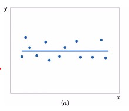
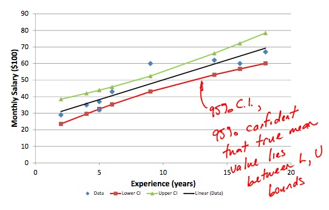
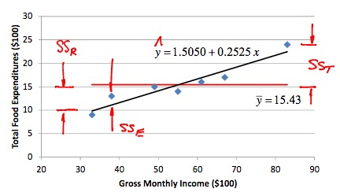

# Lecture 28

## Linear Regression

> 
> $$
\begin{align}
\hat{y} &= a + bx_i \\
e_i &= y_i - \hat{y_i}
\end{align}
$$
> where:  
>
> * $y_i$: observed value  
> * $\hat{y_i}$: predicted value

>
> $$
\begin{align}
b &= \frac{S_{xy}}{S_{xx}} \\
  &= \frac{ \sum_{i=1}^{n} (x_i - \overline{x})(y_i - \overline{y}) }{ \sum_{i=1}^{n} (x_i - \overline{x})^2 }
\end{align}
$$
> For hand calculations:
> $$
\begin{align}
S_{xy} &= \sum_{i=1}^{n} x_i y_i - \frac{ \sum x_i \sum y_i }{n} \\
S_{yy} &= \sum_{i=1}^{n} x_i^2 - \frac{\sum x_i \sum x_i}{n} 
\end{align}
$$
> .
>$$
a = \overline{y} - b \overline{x}
$$

## Statistical Model for Linear Regression

> 

> $$Y_i = \alpha + \beta x_i + \epsilon_i$$
> 

## Evaluating Linear Regression Fit

> Conduct hypothesis test with:  
> $H_0: \beta = 0$  
> $H_A: \beta \neq 0$  
> 

# Lecture 29

## Standard Error of Estimators Approach

> To test $H_0$, use the following t-distribution
> $$
\begin{align}
T &= \frac{b - \beta}{S_e / \sqrt{S_{xx}}} \\
S_{xx} &= \sum_{i=1}^{n}(x_i - \overline{x})^2
\end{align}
$$
> where:  
>
> * $S_{xx}$: sums of squares
> * $S_e$: standard error

> $$
\begin{align}
S_e &= \sqrt{\hat{\sigma}^2} \\
\hat{\sigma}^2 &= \frac{ \sum_{i = 1}^n (y_i - (a + bx_i) )^2 }{n-2}
\end{align}
$$

## Confidence Interval of a Point

> 
> A 95% confidence interval will contain the **true** parameter with a probability of 0.95.
> $$\pm t_{\alpha/2, n-2} \cdot S_e \sqrt{ \frac{1}{n} + \frac{ (x_0 - \overline{x})^2 }{S_{xx}} }$$
> <small>$x_0$ is the first (lowest) value</small>
> 

## Prediction Interval

> 
> What is the interval that will capture $x$% of **future, unobserved** variable at that point?
> $$\pm t_{\alpha/2, n-2} \cdot S_e \sqrt{ 1 + \frac{1}{n} +  \frac{ (x_0 - \overline{x})^2 }{S_{xx}} }$$
> 

> 

# Lecture 30

## ANOVA Approach

> $$
\begin{align}
SS_T &= \sum_{i=1}^{n} (y_i - \overline{y})^2 \\
     &= \underbrace{\sum_{i=1}^{n} (\hat{y_i} - \overline{y})^2}_{SS_R} + \underbrace{\sum_{i=1}^{n} (y_i - \hat{y_i})^2}_{SS_E}
\end{align}
$$
> where:  
> 
> * $SS_T$(**Total Sums of Squares**): Error in prediction if $\overline{y}$ is used. ($=S_{yy}$)  
> * $SS_R$(**Regression Sums of Squares**): Portion of total error explained by regression model.  
> * $SS_E$(**Error Sums of Squares**): Error in prediciton if predictor is used.
> 

## Coefficient of Determination ($r^2$)

> $$
\begin{align}
R^2 &= \frac{SS_R}{SS_T} \\
    &= \frac{SS_T - SS_E}{SS_T} \\
    &= 1 - \frac{SS_E}{SS_T}
\end{align}
$$
> The closer $R^2$ is to 1, the better the fit.

## Sample Correlation Coefficient ($r$)

> $$
\begin{align}
r &= \frac{1}{n-1} \sum \frac{(x_i - \overline{x})}{S_x} \cdot \frac{(y_i - \overline{y})}{S_y} \\
  &= \frac{ S_{xy} }{ \sqrt{S_{xx} S_{yy}} }
\end{align}
$$