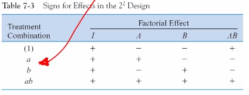
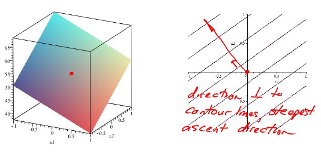

# Lecture 31

## $2^k$ Factorial Experiments

>
> 

## Contrast Table

>
> 

>
> Main Effect:
> $$
\begin{align}
A &= \frac{[a + ab - b - (1)]}{2n} \\
B &= \frac{[b + ab - a - (1)]}{2n}
\end{align}
$$
> Interaction Effect:
> $$AB = \frac{[ab + (1) - a - b]}{2n}$$
> <small>Get the signs from the contrast table.</small>

## Testing if effect is significant

> Approaches:
> 1. Hypothesis Testing
> 2. Confidence Interval

> Standard Error of Effects
> $$S_e = \sqrt{\frac{ \hat{\sigma}^2 }{ n \cdot 2^{k-2} }}$$

>
> $$
\begin{align}
\hat{\sigma}^2 &= \frac{ \sum_{i=1}^{2^k} \hat{\sigma_i}^2 }{2^k} \\
\hat{\sigma_i}^2 &= \frac{ \sum_{j=1}^{n} (y_{i,j} - \overline{y_i})^2 }{ n - 1 }
\end{align}
$$
> where:  
> 
> * $\hat{\sigma}^2$:  Average of variances for each treatment  
> * $\hat{\sigma_i}^2$: Variance at each treatment

### 1. Hypothesis Testing

> 
> $H_0: Effect = 0$  
> $H_A: Effect \neq 0$  
> Use t distribution since $\sigma^2$ is unknown
> $$
\begin{align}
t_{\text{ratio}} &= \frac{\text{effect}}{S_e(\text{effects})} \\
k &= 2^K (n-1) \tag{d.o.f.}
\end{align}
$$

### 2. Confidence Interval

> $$\text{effect} \pm 2 \cdot S_e(\text{effects}) \tag{\approx 95% C.I.}$$
> If the 95% CI contains zero, effect is not significant

# Lecture 33

## $2^3$ Factorial Design
> 

> $$A = \frac{[\text{contrast}]}{4n}$$
> Note effects are divided by **4**n now.

# Lecture 34

## Response Surface Methods

> $$Y = \overline{y} + (\frac{A}{2})x_1 + (\frac{B}{2})x_2 + (\frac{AB}{2})x_1 x_2$$
>   
>
> 

> 1. Reduce response surface to 1st order by removing interaction term
> 2. Go orthogonal to contour lines (orthogonal to response equation without interaction term)
> 