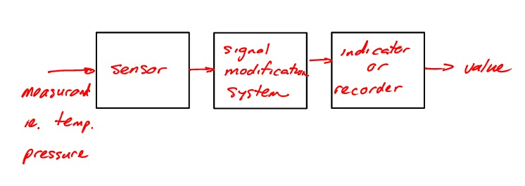

---
header-includes:
  - \usepackage{booktabs}
---

# Lecture 17 - Measuring Temperature

A measurement system consists of
```flow
st=>start: Measurand
sensor=>operation: Sensor
op2=>operation: Signal Modification System
op3=>operation: Indicator or Recorder
e=>end: Value
st->sensor->op2->op3->e
```



----------


####**ex.** thermometer
**Sensor**: thermal expansion/contraction of liquid as function of temp.
**Signal Modification System**: Small diameter tube connected to fluid reservoir
**Indicator**: Scale on tube

----------

### Different Temperature Measurement Devices


+----------------------------------+-----------------------+--------------------------------------+----------------------------------+
| Device                           | Sensor                | Signal Modification System           | Indicator                        |
+----------------------------------+-----------------------+--------------------------------------+----------------------------------+
| Thermocouple                     | Thermocouple Junction | Voltage $\rightarrow$ Temperature    | Digital Readout                  |
+----------------------------------+-----------------------+--------------------------------------+----------------------------------+
| Resistance Temperature Detectors | Resistor              | Resistance $\rightarrow$ Temperature | Digital Readout                  |
+----------------------------------+-----------------------+--------------------------------------+----------------------------------+
| Thermistor                       | Semi-Conductor Device | Resistance $\rightarrow$ Temperature |  - Large Size (vs. thermocouple) |
|                                  |                       |                                      |  - non-linear                    |
+----------------------------------+-----------------------+--------------------------------------+----------------------------------+

.

+----------------------------------+-----------------------------------------+---------------------------+-----------------------------------------------+
| Device                           | Accuracy                                | Advantages                | Limitation                                    |
+----------------------------------+-----------------------------------------+---------------------------+-----------------------------------------------+
| Thermocouple                     | $\pm 0.5^oC - 1.0^oC$ for sensor        |  - small                  |  - non-linear                                 |
|                                  | $\pm 0.5^oC - 2.0^oC$ for instrument    |  - cheap                  |  - accuracy depends on instrument quality     |
|                                  |                                         |  - wide application range |                                               |
+----------------------------------+-----------------------------------------+---------------------------+-----------------------------------------------+
| Resistance Temperature Detectors | $\pm 0.3^oC$                            | - Highly accurate         |  - Expensive                                  |
|                                  | $\pm$ small errors for V,I measurements | - linear                  |  - Large sensor size, leads to loading errors |
+----------------------------------+-----------------------------------------+---------------------------+-----------------------------------------------+
| Thermistor                       | Up to $\pm 0.1^oC$                      |  - Low cost               |  - Large Size (vs. thermocouple)              |
|                                  |                                         |  - Easy to implement      |  - non-linear                                 |
+----------------------------------+-----------------------------------------+---------------------------+-----------------------------------------------+