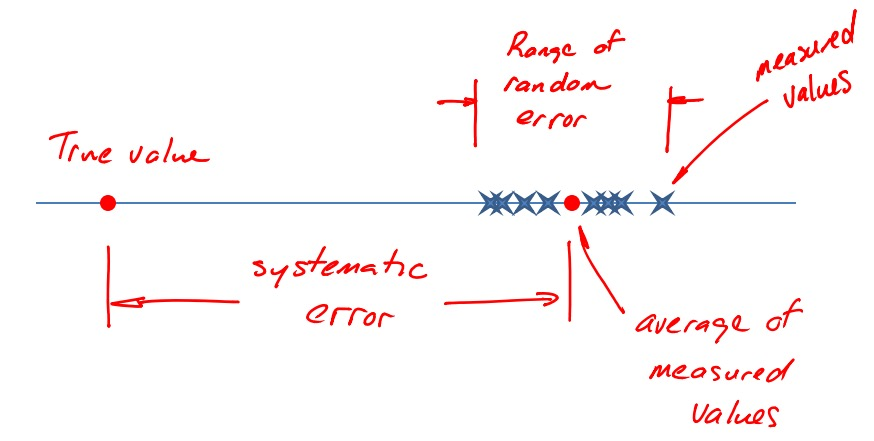

---
header-includes:
	- \usepackage{xfrac}
---
# Experimental Uncertainty

> statistical analysis:  
>
> - experimental uncertainty based on $\overline{x}, s$  
> - requires experiment to be ran first

> Validity of measurement
> 
> - measure of how close the output of a measurement system matches the real value
> - $error = value_{measured} - value_{true}$

> Uncertainty
>
> Estimate a measurement with some limits of error  
> ex. $V = 100V \pm 1V$

> Error (Uncertainty) has two categories:
> 
> 1. Systematic
> 	* fixed, bias error
> 	* sources
> 		i. Calibration
>		ii. Loading error (intrusive measurment device)
> 		iii. Spatial error (affected by enviornment)
> 2. Random
> 	* Lack of repeatibility, random noise, uncontrolled variables
> 
> 

> General method for solving uncertainty questions involving multiple var
> 
> 1. Differentiate results
> 2. Take root mean square of the uncertainty result
> 
> General uncertainty formula
> $w_R = [(w_1 \cdot \frac{\partial R}{\partial x_1})^2 + (w_2 \cdot \frac{\partial R}{\partial x_2})^2 + \cdots + (w_n \cdot \frac{\partial R}{\partial x_n})^2]^{\frac{1}{2}}$

> If $R = Cx_1^2x_2^b \cdots x_n^N$  
>
> $$\frac{\partial R}{\partial x_1} = aCx_1^{a-1}x_2^b \cdots x_n^N = a\frac{R}{x^1}$$
>
> $$\frac{\partial R}{\partial x_2} = bCx_1^{a}x_2^{b-1} \cdots x_n^N  = b\frac{R}{x^2}$$
> 
> $$\frac{W_r}{R} = [( w_1 \cdot \frac{a}{x_1} )^2 + ( w_2 \cdot \frac{b}{x_2} )^2 + \cdots + ( w_n \cdot \frac{N}{x_n} )^2 ]^{\frac{1}{2}}$$