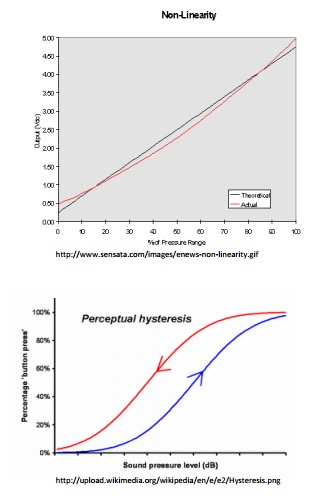

# Systematic and Random Errors

## Error Types

> 1. Non-linearity (systematic)
> 2. Hysteresis (systematic)
> 	  * different values for increasing/decreasing load
> 3. non-repeatability (random)
> 
> 

## Notation

> Systematic Error - $B_x$  
>  - independent of sample size
> 
> Random Error - $P_x$  
>  - depends on sample size through the t distribution

## Error of the sample mean

> $$P_{\overline{x}} = \pm t \cdot \frac{s_x}{\sqrt{n}}$$
> where  
> i. $t$ is the t value for 95% confidence <small>When d.o.f. > 30, use t=2</small>  
> ii. $S_x$ is the sample standard dev.  
> iii. $n$ is the sample size