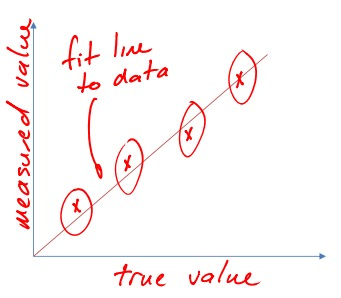
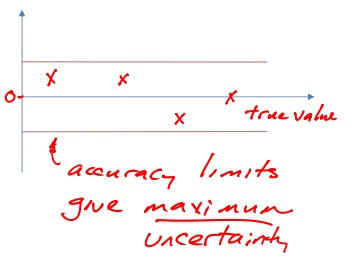

# Random Errors and Calibration

> $$W_{\overline{x}} = (B_x^2 + P_{\overline{x}^2}^{1/2})$$

## Calibration
> def.: comparison of measured value with a standard

## Standards
> ### Primary Standards
> 1. Mass - international prototype kilogram, etc.
> 2. Time - radiation frequency
> 3. Length - length of a proton travel path
> 
> ### Secondary Standards
> 1. Mass - weights
> 2. Gauge Blocks - precise machined metal
> 3. Sesnors of known accuracy

## Calibration Procedure
> 1. Take data
> 2. Plot calibration curve  
>  -   
> 3. Deviation Plot (true value - best fit line)
>  - 