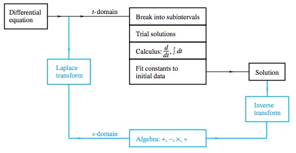
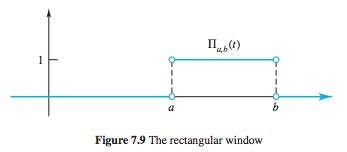
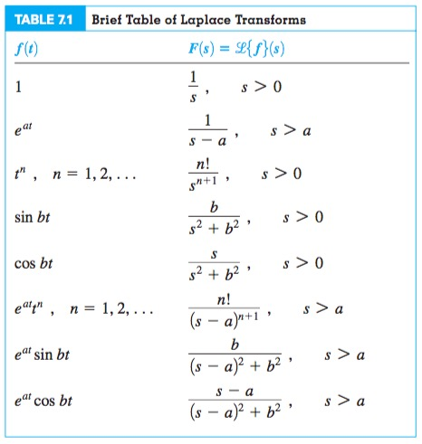

# Ch. 7.2 Laplace Transform

> The laplace transform of $f$ is
> $$ F(s) := \int_{0}^{\infty} e^{-st} f(t) dt $$
> 

## Existance of Laplace Transform for a function

> LT exists for f(t) if it is  
>
> 1. Piecewise Continuous  
> 2. Exponential Order

> Piecewise contiuous if:  
>
> 1. Has finite number of jump discontinuities  
> 2. f(t) approaches finite limit at each discontinuity

> Exponential Order of $\alpha$ if it does not grow faster than $e^{\alpha t}$:
> $$|f(t)| \leq Me^{\alpha t} \quad\text{for all } t \geq T$$
> <small>where $M, T$ are positive constants</small>

## Linearity

> The Laplace Transform is *linear*
> $$ \mathscr{L}\{f_1 + f_2\} = \mathscr{L}\{f_1\} + \mathscr{L}\{f_2\} $$
> $$ \mathscr{L}\{cf_1\} = c\mathscr{L}\{f_1\} $$

## Jump Discontinuity

> $f(t)$ is said to have a *jump discontinuity* at $t_0 \in (a, b)$ if $f(t)$ is discontinuous at $t_0$ but the one-sided limits
> $$\lim{t\to t_0^-} f(t) and \lim{t\to t_0^+} f(t)$$
> exists as *finite* numbers.  
> If the discontinuity occurs at an endpoint, $t_0 = a \ (or \ b)$, a jump discontinuity occurs if the one sided limit of $f(t)$ as $t\to a^+ or\ (t \to b^-)$ exists as a *finite* number.

## Laplace Transform of High Order Derivatives

> $$ \mathscr{L}\{f^{(n)}\}(s) = s^n\mathscr{L}\{f\}(s) - s^{n-1}f(0) - s^{n-2}f'(0) - \cdots - f^{(n - 1)}(0) $$

## Translation in $s$

> $$ 
\begin{align*}
\mathscr{L}(e^{at}f) &= \int_0^{\infty} e^{-st} e^{at} f(t) dt \\
					 &= \int_0^{\infty} e^{(a-s)t} f(t) dt \\
					 &= F(s-a)
\end{align*}
$$

## Partial Fractions

> ex.  
> $$\frac{x^2+15}{(x+3)^2(x^2+3)} = \frac{A_1}{x+3} + \frac{A_2}{(x+3)^2} + \frac{Bx+C}{x^2+3}$$

> $$
\begin{align}
\frac{As+B}{as^2 + bs +c} &= \frac{\frac{A}{a}s + \frac{B}{a}}{s^2 + \frac{b}{a}s + \frac{c}{a}} \\
&= \frac{E(s-\alpha) + D\beta}{(s-\alpha)^2 + \beta^2}
\end{align}
$$  
> where  
>
> * $\alpha = -\frac{b}{2a}$  
> * $\beta = \frac{\sqrt{4ac-b^2}}{2a}$
>
> Then inverse each term to $e^{\alpha t}\cos(bt)$ and $e^{at}\sin(bt)$

## Convolution

> $$h(t) = (f * g)(t) = \int_{0}^{t} f(\tau)g(t-\tau)$$

## Heaviside

> $$
M \cdot H(t-a) = \left\{
        \begin{array}{ll}
            0 & \quad t < a \\
            M & \quad t > a
        \end{array}
    \right.
$$
> 
> $$
M \cdot (H(t-a) - H(t-b) = \left\{
        \begin{array}{ll}
            0 & \quad t < a \\
            M & \quad a < t < b \\
            0 & \quad b < t
        \end{array}
    \right.
$$
> 

> $$
\begin{align}
\mathscr{L} \{H(t-a)f(t-a)\} &= e^{-as} \mathscr{L} \{f(t)\} \\
\mathscr{L} \{H(t-a)f(t)\} &= e^{-as} \mathscr{L} \{f(t+a)\}
\end{align}
$$

## Laplace Transforms Table

> 

## Helpful integral formulas

> $$\int e^{bx}cos(ax)dx = e^{bx}\frac{a sin(ax) + b cos (ax)}{a^2 + b^2}$$
> $$\int e^{bx}sin(ax)dx = e^{bx}\frac{b sin(ax) - a cos(ax)}{a^2 + b^2}$$

## Laplace Transform Table 
http://tutorial.math.lamar.edu/pdf/Laplace_Table.pdf