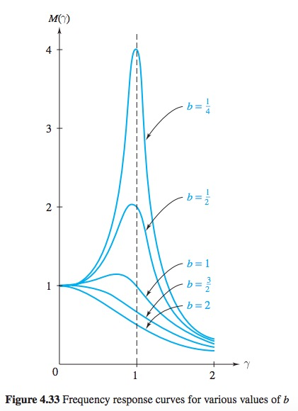

# Mechanical Vibrations

# Ch 4.9 Free Vibrations

> For a cosine forcing function on a mass-spring system
> $$m\frac{d^2y}{dt^2} + b\frac{dy}{dt} + ky = F_0 \cos{\gamma t}$$
> Solution for $0 < b^2 < 4mk$  
> $$y(t) = \underbrace{Ae^{-(b/2m)t} \sin(\frac{\sqrt{4mk - b^2}}{2m}t + \phi)}_{y_h,\text{ (transient)}} + \underbrace{\frac{F_0}{\sqrt{(k-m\gamma^2)^2 + b^2\gamma^2}}\sin(\gamma t + \theta)}_{y_p, \text{ (steady-state)}}$$

> Factor in the steady state is called frequency or gain factor $M(\gamma)$
> $$M(\gamma) = \frac{1}{\sqrt{(k-m\gamma^2)^2 + b^2\gamma^2}}$$  

> 

> ## Frequency Response Curve
> Graphing $M(\gamma)$ with fixed $m, b, k$ is called the ***frequency response curve*** or ***resonance curve***
> <small>*As $\gamma \rightarrow \infty$, $M(\gamma) \rightarrow 0$ since the inertia limits how it can respond to extremely rapid vibraitons*</small>  
> 

## Undamped Free Vibration

> <small>where $\omega_0$ is the angular frequency(rad/s)</small>
> $$\frac{d^2x}{dt^2} + \omega^2x = 0$$

> $$ x_g = c_1cos(\omega t) + c_2 \sin(\omega t)$$
> Using identity $$ \sin(A + B) = \sin(A)\cos(B) + \cos(A)\sin(B)$$
> $$ x_g = \underbrace{E\cos(\phi)}_{c_1} \sin(\omega t) + \underbrace{E\sin(\phi)}_{c_2} \cos(\omega t)$$
> $$x_g = E\sin(\omega t + \phi)$$  
> where
> 
> * $E$ is the amplitude
> * $\phi$ is the phase angle
> * $\frac{2\pi}{\omega}$ is the period

## Damped Free Vibration

> $$\frac{d^2x}{dt^2} + \frac{c}{m}\frac{dx}{dt} + \frac{k}{m}x = 0$$
> Using aux. eq. 
> $$r_{1,2} = -\frac{c}{2m} \pm \frac{sqrt(c^2 - 4km)}{2m}$$

### Over-damped

> $\frac{c^2}{m^2} - \frac{4k}{m} > 0$
> $$x_g = \exp(-\frac{c}{2m}t)(c_1 \exp(\frac{\sqrt{c^2-4km}}{2m}t)) + c_2 \exp(-\frac{\sqrt{c^2-4km}}{2m}t))$$

### Critical Damping

> $\frac{c^2}{m^2} - \frac{4k}{m} = 0$  
> $$x_g = \exp(-\frac{c}{2m}t)(c_1 + c_2 t)$$

### Underdamped

> $\frac{c^2}{m^2} - \frac{4k}{m} < 0$  
> $$x_g = \exp(-\frac{c^2}{m^2}t)[c_1 \cos(\frac{\sqrt{4km-c^2}}{2m}t) + c_2 \sin(\frac{\sqrt{4km - c^2}}{2m}t)]$$

# Ch. 4.10 Force Vibrations

> $$mx'' + cx' + kx = F(t)$$

> $$x_p = \frac{F_0}{\sqrt{(k-m\omega^2)^2 + c^2 \omega^2}} \sin(\omega t + \phi)$$
> where
> 
> * $\phi = \tan^{-1}(\frac{k-m\omega^2}{c\omega})$
> * $E = \sqrt{c^2 \omega^2 + (k - m\omega^2)^2}$

# Coupled Spring-Mass Systems

> Mass 1
> $$
m_1x_1'' = F_1 + k_2(x_2-x_1) - k_1x_1\\
m_1x_1'' + (k_1+k_2)x_1 - k_2x_2 = F_1
$$
> Mass 2
> $$m_2x_2'' = F_2 - k_2(x_2-x_1)\\
m_2x_2'' + k_2x_2 - k_1x_1 = F_2$$

# Gaussian Elimination

> Sub differential operator $D = \frac{d}{dt}$ and row reduce

# 🔑 Sinusoidal Properties

> $A \sin(Bt-C) + D$
>
> * A: amplitude
> * B: angular frequency
> * Period = $\frac{2\pi}{B}$
> * Phase shift to the right by $\frac{C}{B}$
> * D: Vertical shift
