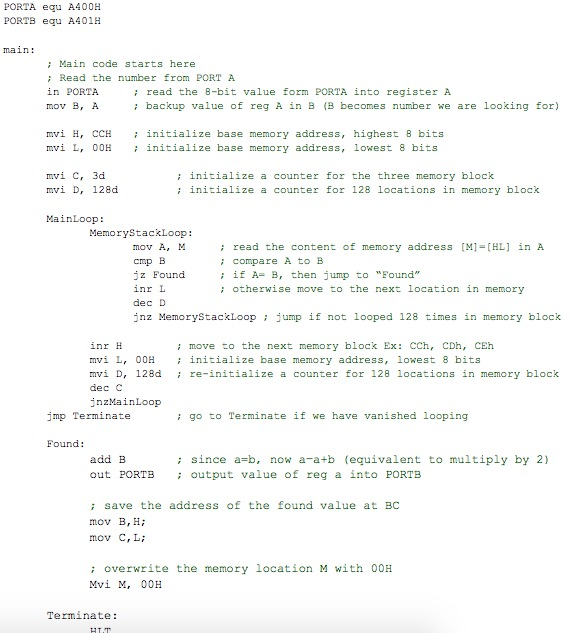
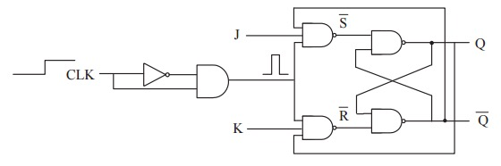

# PLC

> * Need previous state information for state transition  
> * Only have one Latch and Unlatch rung for each state bit  

# Assembly

> ```Assembly
MOV	CL, 10
L1:
<LOOP-BODY>
DEC	CL
JNZ	L1
```



